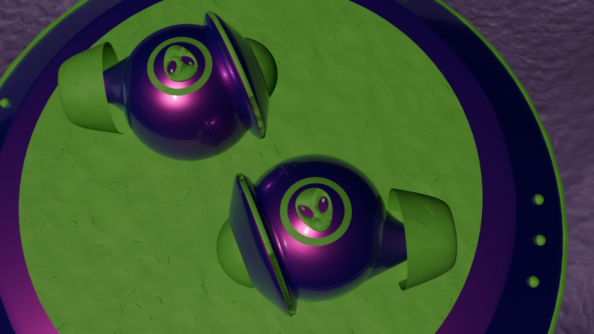

# Kirs_Mikhail_Earbuds_Promotional_Page

## Overview
This project is a promotional site for my redesigned version of **Squeezit** — a brand I brought back in 2025 with a new **alien-inspired** theme.

Squeezit used to be something totally different, but turned it into something completly diffirent.  
Now it’s a line of **futuristic earbuds** that look like alien tech and deliver “out-of-this-world” sound.  
The website is meant to show off the design, interactivity, and animation side of the project and also be a promotional material.

## Features
- **3D AR model** – spin and explore the earbuds in real time  
- **Animated hotspots** – info pops up with smooth GreenSock animations  
- **X-ray slider** – reveals the internal parts of the earbuds  
- **Scroll animations** – triggered by GreenSock ScrollTrigger  
- **Responsive layout** – works on mobile, tablet, and desktop  
- **Alien-inspired design** – glowing, cosmic color palette and UI

## Tech Stack
- HTML5  
- CSS3 / SASS  
- JavaScript (IIFE structure)  
- GreenSock (GSAP + ScrollTrigger)  
- Cinema 4D (3D modeling & rendering)  
- Model Viewer (AR integration)  
- Git + GitHub for version control

## Purpose
This project mixes design, animation, and interactivity to promote the new **Squeezit** brand.  
It’s basically my take on how to combine 3D product design, web dev, and animation into one clean experience.  

The idea: make a fake but believable headphone brand that feels like *alien tech redesigned for humans.*

## The Brand – Squeezit 2025
Squeezit was revived with a whole new concept in 2025, which started as a "soda" brand for kids, inspired by space travel, alien energy, and strange glowing materials, and now that is also a headphones brand.  

The earbuds are shaped like organic tech — smooth, glowing, and made to feel alive.

## Installation
No installation needed.  
Just open the `index.html` file in your browser.

## Usage
Scroll through the page to trigger animations.  
Click the hotspots and try the X-ray slider to explore the earbuds. (when it will be ready of course)

## Contributing

1. Fork it!
2. Create your feature branch: `git checkout -b my-new-feature`
3. Commit your changes: `git commit -am 'Add some feature'`
4. Push to the branch: `git push origin my-new-feature`
5. Submit a pull request :D

## History
- Updated HTML
- uPDATED CSS
- Updated README
- Added AR model and animated hotspots  

## Credits
**Mikhail Kirs** – Design, 3D, and Development  

## License
MIT License

**Contact:**
[topkun6666@gmail.com](mailto:topkun6666@gmail.com)  
+1 (226) 224-6074  
[GitHub Profile](https://github.com/Mikki667)

